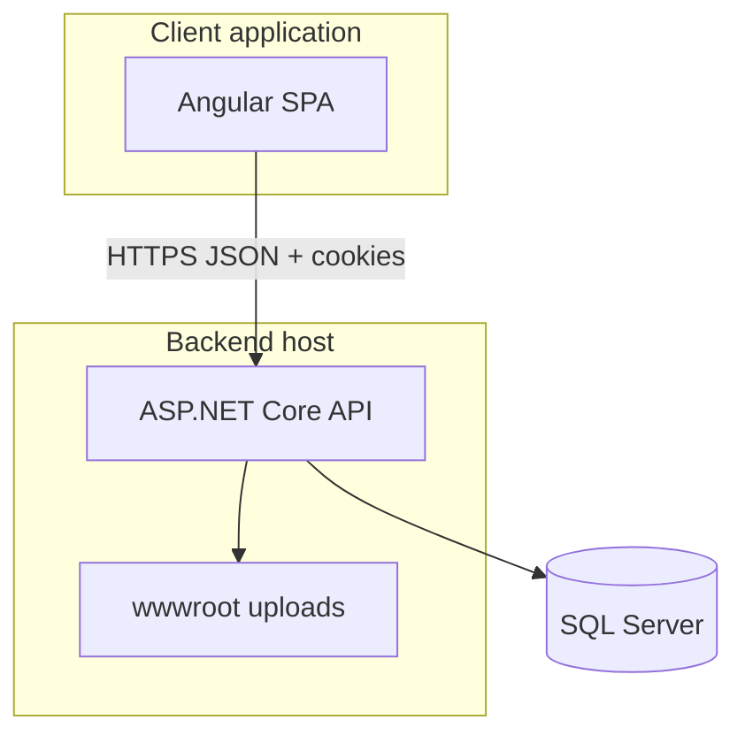
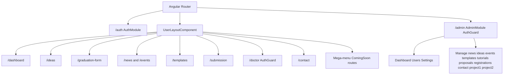
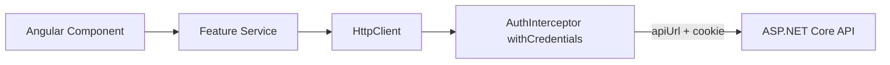
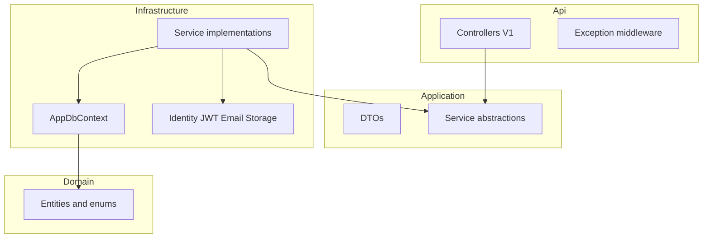
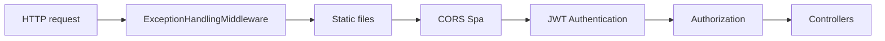
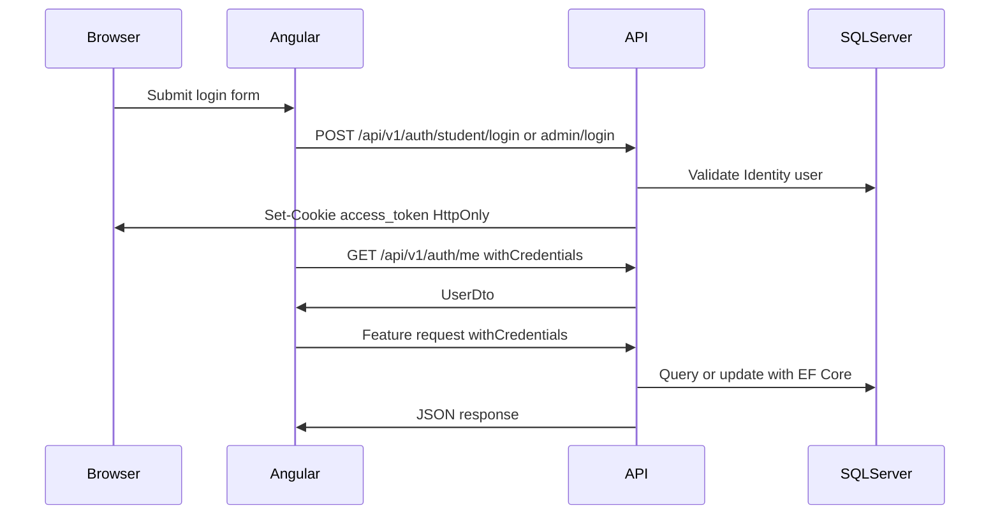
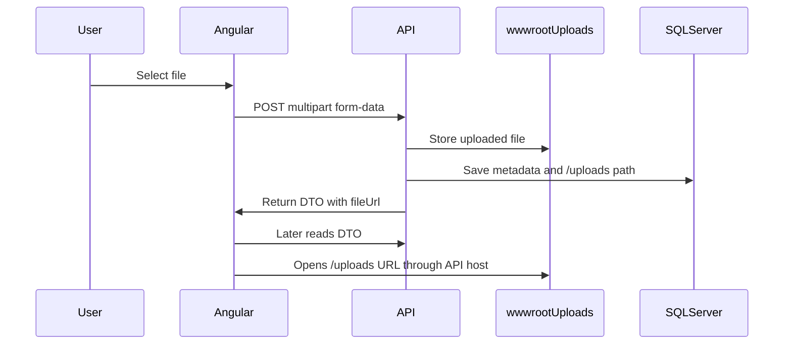
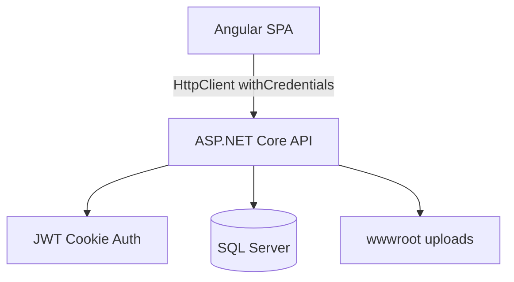

# MUST Graduation Platform — Architecture and Workflows

This document explains the current codebase structure, workflows, and architecture for the Angular frontend, the ASP.NET Core backend, and the SQL Server database. It complements [FRONTEND_INTEGRATION.md](../FRONTEND_INTEGRATION.md) and [FRONTEND_CHANGES.md](FRONTEND_CHANGES.md).

Diagram images are available in [diagrams/](diagrams/):

| Image | Topic |
|-------|-------|
| [01-angular-architecture.png](diagrams/01-angular-architecture.png) | Angular app structure and routing |
| [02-backend-architecture.png](diagrams/02-backend-architecture.png) | Backend layers and API request pipeline |
| [03-database-erd.png](diagrams/03-database-erd.png) | SQL Server / EF Core conceptual data model |
| [04-full-system-integration.png](diagrams/04-full-system-integration.png) | Frontend, backend, database, and file storage integration |

The Mermaid diagrams in this document are the editable source of truth. The PNG files are intended for quick reading, presentations, and sharing.

---

## 1. System Summary

The repository contains two major application surfaces:

1. **Angular SPA** in [`src/`](../src/) — the main graduation portal. It contains authentication, student workflows, admin CMS screens, faculty dashboard routes, graduation submissions, templates, news, events, contact messages, and settings.
2. **ASP.NET Core API + SQL Server** in [`backend/`](../backend/) — the REST API, authentication, business services, file uploads, EF Core database access, migrations, and Identity user storage.



---

## 2. Angular Frontend

### 2.1 Purpose

The Angular app is the primary graduation platform. It is an NgModule-based Angular project configured in [`angular.json`](../angular.json). It uses SCSS, RTL-friendly layouts, shared shell components, lazy-loaded feature modules, and a .NET API backend.

The API base URL is configured in:

- [`src/environments/environment.ts`](../src/environments/environment.ts)
- [`src/environments/environment.prod.ts`](../src/environments/environment.prod.ts)

Both environments are expected to point to an API URL ending with `/api/v1`.

### 2.2 Folder Structure

| Path | Responsibility |
|------|----------------|
| [`src/app/app-routing.module.ts`](../src/app/app-routing.module.ts) | Top-level Angular routes and lazy module loading |
| [`src/app/core/`](../src/app/core/) | Guards, interceptors, layouts, models, services, utilities |
| [`src/app/features/`](../src/app/features/) | Feature modules such as auth, dashboard, ideas, admin, graduation, templates, contact |
| [`src/app/shared/`](../src/app/shared/) | Shared UI components, reusable shell pieces, and shared module exports |

### 2.3 Routing and Layout Workflow

The main routes are declared in [`src/app/app-routing.module.ts`](../src/app/app-routing.module.ts):

- `/auth` lazy-loads the authentication module.
- `/dashboard`, `/ideas`, `/graduation-form`, `/news`, `/events`, `/templates`, `/resources/tutorials`, `/contact`, `/submission`, and `/doctor` are mounted under [`UserLayoutComponent`](../src/app/core/layouts/user-layout/user-layout.component.ts).
- `/admin` lazy-loads [`AdminModule`](../src/app/features/admin/admin.module.ts), guarded by [`AuthGuard`](../src/app/core/guards/auth.guard.ts), and uses [`AdminLayoutComponent`](../src/app/core/layouts/admin-layout/admin-layout.component.ts).
- `/doctor` is also guarded and currently uses `Admin` / `SuperAdmin` roles for faculty behavior.
- Many public mega-menu routes are mapped to [`ComingSoonComponent`](../src/app/shared/components/coming-soon/coming-soon.component.ts).



### 2.4 Angular Shell and Navigation

The main user shell is built from:

- Header: [`src/app/shared/components/header/`](../src/app/shared/components/header/)
- Footer: [`src/app/shared/components/footer/`](../src/app/shared/components/footer/)
- Hero banner/photo slider: [`src/app/shared/components/hero-banner/`](../src/app/shared/components/hero-banner/)
- Quick links inside the hero: [`src/app/shared/components/quick-nav-links/`](../src/app/shared/components/quick-nav-links/)
- Mega-menu data: [`src/app/core/data/navigation.data.ts`](../src/app/core/data/navigation.data.ts)

Important distinction:

- The **top header mega-menu** is driven by `MENU_ITEMS` in `navigation.data.ts`.
- The **hero/photo slider quick menu** is in `quick-nav-links.component.html` and `quick-nav-links.component.ts`.

### 2.5 Angular HTTP Workflow

The Angular API workflow is:

1. Component handles user interaction.
2. Feature service builds the API call.
3. `HttpClient` sends the request to `environment.apiUrl`.
4. [`AuthInterceptor`](../src/app/core/interceptors/auth.interceptor.ts) adds `withCredentials: true`.
5. Browser sends the HttpOnly `access_token` cookie to the API.
6. API returns camelCase JSON.



### 2.6 Main Angular Workflows

#### Authentication

- Identify user: `POST /api/v1/auth/identify`
- Admin login: `POST /api/v1/auth/admin/login`
- Student OTP: `POST /api/v1/auth/student/send-code`
- Student login: `POST /api/v1/auth/student/login`
- Student registration: `POST /api/v1/auth/register`
- Current user: `GET /api/v1/auth/me`
- Logout: `POST /api/v1/auth/logout`

The backend sets the JWT in an HttpOnly cookie named `access_token`, so Angular does not manually store the token in local storage.

#### Admin CMS

[`src/app/features/admin/admin-routing.module.ts`](../src/app/features/admin/admin-routing.module.ts) maps many admin management pages to one reusable [`AdminManagementComponent`](../src/app/features/admin/admin-management/admin-management.component.ts) with route `data.type`.

Managed areas include:

- News
- Ideas
- Events
- Templates
- Tutorials
- Proposals
- Idea registrations
- Contact messages
- Project 1 submissions
- Project 2 submissions

#### Graduation and Submissions

Graduation and project submission flows call API services for:

- Proposal submission
- Idea registration
- Project 1 and Project 2 files
- Graduation requirement files
- Faculty dashboard review data

Uploaded files are stored on the backend under `wwwroot/uploads`, then returned as `/uploads/...` paths. Angular uses [`api-url.util.ts`](../src/app/core/utils/api-url.util.ts) to convert those to absolute URLs when needed.

---

## 3. Backend and Database

### 3.1 Backend Project Structure

| Project | Role |
|---------|------|
| [`MustGraduationPlatform.Api`](../backend/MustGraduationPlatform.Api/) | HTTP entry point, controllers, middleware, Swagger, health checks |
| [`MustGraduationPlatform.Application`](../backend/MustGraduationPlatform.Application/) | DTOs and service abstractions |
| [`MustGraduationPlatform.Domain`](../backend/MustGraduationPlatform.Domain/) | Entities and enums |
| [`MustGraduationPlatform.Infrastructure`](../backend/MustGraduationPlatform.Infrastructure/) | EF Core, Identity, JWT, email, storage, service implementations |



### 3.2 API Startup and Middleware

[`Program.cs`](../backend/MustGraduationPlatform.Api/Program.cs) configures:

- Application and infrastructure dependency injection
- Multipart upload limits
- JWT Bearer auth
- Cookie token extraction
- Authorization
- Health checks
- Controllers with camelCase JSON
- Swagger in development
- CORS policy named `Spa`
- Static file serving
- Database seeding at startup

Request flow:



### 3.3 Authentication Architecture

[`AuthController`](../backend/MustGraduationPlatform.Api/Controllers/V1/AuthController.cs) exposes identify, login, registration, current user, and logout endpoints.

[`AuthService`](../backend/MustGraduationPlatform.Infrastructure/Services/AuthService.cs) implements the workflow:

1. Validate MUST email rules.
2. Locate or create `ApplicationUser`.
3. Check password or activation code.
4. Create JWT through `JwtTokenService`.
5. Append cookie named `access_token`.
6. Return `UserDto`.

Cookie behavior:

- `HttpOnly = true`
- `Path = /`
- Development: `SameSite=Lax`
- Production: `SameSite=None` and `Secure=true`

This design supports cross-origin SPA hosting when API CORS is configured correctly.

### 3.4 Controllers by Domain

Controllers are in [`backend/MustGraduationPlatform.Api/Controllers/V1/`](../backend/MustGraduationPlatform.Api/Controllers/V1/):

- `AuthController` — login, registration, current user, logout.
- `UsersController` — admin user management.
- `IdeasController` and `IdeaCategoriesController` — ideas and categories.
- `DepartmentsController` — departments.
- `NewsController` and `EventsController` — public and admin content.
- `TemplatesController` and `TutorialsController` — resources and uploaded documents.
- `ProposalsController` and `ProjectSubmissionsController` — proposal and project file workflows.
- `GraduationController` — graduation project and requirement file endpoints.
- `ContactController` — contact messages.
- `SiteSettingsController` — admin site settings.
- `DashboardController` — dashboard summary data.
- `DoctorController` — faculty dashboard.

### 3.5 Database Layer

[`AppDbContext`](../backend/MustGraduationPlatform.Infrastructure/Persistence/AppDbContext.cs) extends `IdentityDbContext<ApplicationUser, IdentityRole<Guid>, Guid>`, so Identity tables live alongside platform tables.

Configured `DbSet`s include:

- `Departments`
- `IdeaCategories`
- `Ideas`
- `NewsArticles`
- `CalendarEvents`
- `DocumentTemplates`
- `TutorialDocuments`
- `Proposals`
- `ProjectSubmissions`
- `ContactMessages`
- `SiteSettings`
- `DashboardActivities`
- `RegistrationOtps`
- `GraduationRequirementFiles`

Important EF rules:

- `ApplicationUser.DepartmentId` is optional and deletes are `SetNull`.
- `ApplicationUser.NormalizedEmail` is unique.
- `Department.Code` is unique.
- `SiteSetting.Key` is unique.
- `RegistrationOtp.NormalizedEmail` is indexed.
- `(GraduationRequirementFile.UserId, GraduationRequirementFile.RequirementKey)` is unique.

```mermaid
erDiagram
  Department ||--o{ ApplicationUser : \"DepartmentId\"
  ApplicationUser ||--o{ GraduationRequirementFile : \"UserId\"
  Department {
    int Id
    string Code
    string Name
  }
  ApplicationUser {
    guid Id
    string FullName
    string Email
    string UserRole
  }
  GraduationRequirementFile {
    int Id
    guid UserId
    string RequirementKey
  }
  Idea {
    int Id
    string Title
    string Category
    string Status
  }
  ProjectSubmission {
    int Id
    string Type
    string Status
  }
  SiteSetting {
    int Id
    string Key
    string Value
  }
  RegistrationOtp {
    int Id
    string NormalizedEmail
    string Code
  }
```

Some business relationships are stored as text or loose identifiers rather than strict foreign keys. For example, `Idea` stores `Category` and supervisor data as fields, while `ProjectSubmission` stores registration/proposal payloads and attachment metadata as strings or JSON.

### 3.6 File Storage

File uploads use [`IFileStorage`](../backend/MustGraduationPlatform.Application/Abstractions/IFileStorage.cs) and [`WwwRootFileStorageService`](../backend/MustGraduationPlatform.Infrastructure/Storage/WwwRootFileStorageService.cs).

Files are stored under:

```text
backend/MustGraduationPlatform.Api/wwwroot/uploads
```

The API returns paths like:

```text
/uploads/...
```

Frontend code can convert those to absolute URLs using [`fileUrlToAbsolute`](../src/app/core/utils/api-url.util.ts).

---

## 4. Frontend + Backend + Database Workflow

### 4.1 Login Sequence



### 4.2 Upload Sequence



### 4.3 Full System Integration



---

## 5. Operational Notes

| Area | Detail |
|------|--------|
| Swagger | Enabled in Development from [`Program.cs`](../backend/MustGraduationPlatform.Api/Program.cs) |
| Health | `/health`, `/health/live`, `/health/ready` |
| CORS | `Cors:AllowedOrigins` in backend appsettings, credentials enabled |
| JWT | `Jwt` section in backend appsettings |
| SQL | `ConnectionStrings:DefaultConnection` |
| Seed script | [`backend/sql/seed-online-database.sql`](../backend/sql/seed-online-database.sql) |
| Publish scripts | [`backend/publish-for-monsterasp.bat`](../backend/publish-for-monsterasp.bat), [`backend/publish-for-monsterasp.ps1`](../backend/publish-for-monsterasp.ps1) |

---

## 6. Quick Reading Order

For a new developer, read in this order:

1. [`src/app/app-routing.module.ts`](../src/app/app-routing.module.ts)
2. [`src/app/core/interceptors/auth.interceptor.ts`](../src/app/core/interceptors/auth.interceptor.ts)
3. [`backend/MustGraduationPlatform.Api/Program.cs`](../backend/MustGraduationPlatform.Api/Program.cs)
4. [`backend/MustGraduationPlatform.Api/Controllers/V1/AuthController.cs`](../backend/MustGraduationPlatform.Api/Controllers/V1/AuthController.cs)
5. [`backend/MustGraduationPlatform.Infrastructure/Persistence/AppDbContext.cs`](../backend/MustGraduationPlatform.Infrastructure/Persistence/AppDbContext.cs)
6. [`FRONTEND_INTEGRATION.md`](../FRONTEND_INTEGRATION.md)
7. [`docs/FRONTEND_CHANGES.md`](FRONTEND_CHANGES.md)

